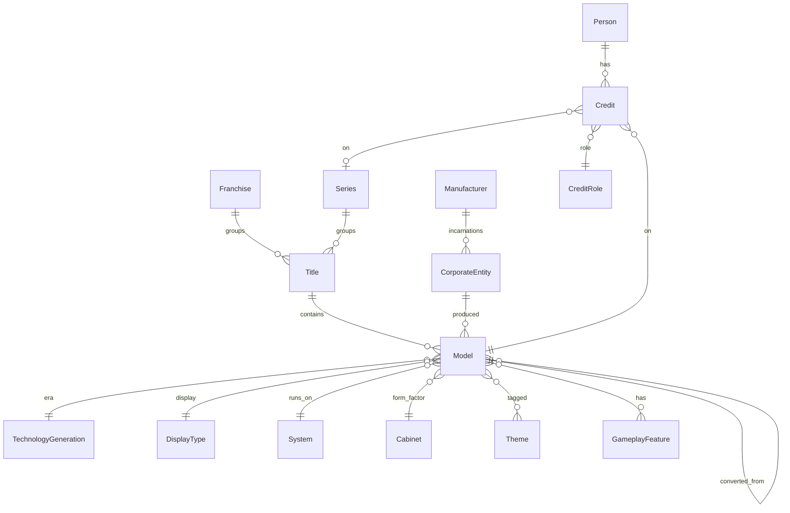

# Catalog Domain Model

This document describes the catalog domain model — the entities and relationships that represent the world of pinball machines.

> **Django naming note:** The domain concept "Model" maps to the Django class `MachineModel` to avoid collision with Django's own `Model` base class. This document uses the domain name "Model" throughout.

## Title, Model & Variants

The _Godzilla_ `Title` has four `Model`s:

| Title    | Model                       | Year | variant_of         |
| -------- | --------------------------- | ---- | ------------------ |
| Godzilla | Godzilla (Pro)              | 2021 | —                  |
| Godzilla | Godzilla (Premium)          | 2021 | —                  |
| Godzilla | Godzilla (Limited Edition)  | 2021 | Godzilla (Premium) |
| Godzilla | Godzilla (70th Anniversary) | 2024 | Godzilla (Premium) |

- **`Title`**: the canonical identity of a game design, regardless of editions or manufacturers. _Medieval Madness_ is one Title spanning the 1997 Williams original and all Chicago Gaming remakes.
- **`Model`**: a distinct, buyable machine — an actual SKU. The _Medieval Madness_ Title contains six Models: the Williams original (1997), and five Chicago Gaming remakes (2015–2025).
- **`Variants`**: a Model that shares the same gameplay as another Model, differing only in cosmetics (cabinet art, numbered plaques, toppers, colored plastics). Variants are linked via `variant_of`. Godzilla Pro and Premium are separate canonical Models because they have different gameplay and hardware. The LE and 70th Anniversary models are variants of Premium: same gameplay, different dress.

A standalone game that has never been remade — like Gottlieb's 1965 _Buckaroo_ — has one `Title` and one `Model`.

### Remakes

The _Cactus Canyon_ Title includes the 1998 original and its remakes by Chicago Gaming:

| Title         | Model                     | Manufacturer   | Year | remake_of     |
| ------------- | ------------------------- | -------------- | ---- | ------------- |
| Cactus Canyon | Cactus Canyon             | Midway / WMS   | 1998 | —             |
| Cactus Canyon | Cactus Canyon (Remake LE) | Chicago Gaming | 2021 | Cactus Canyon |
| Cactus Canyon | Cactus Canyon (Remake SE) | Chicago Gaming | 2021 | Cactus Canyon |

A **remake** is a Model that recreates an older game with new technology. Linked via `remake_of`. The original and its remakes all belong to the same Title.

### Conversions

_Star Trek_ (Bally, 1979) was converted into machines by other manufacturers:

| Title     | Model        | Manufacturer         | Year | converted_from |
| --------- | ------------ | -------------------- | ---- | -------------- |
| Star Trek | Star Trek    | Bally                | 1979 | —              |
| Star Trek | Challenger V | Professional Pinball | 1981 | Star Trek      |
| Star Trek | Dark Rider   | Geiger-Automatenbau  | 1985 | Star Trek      |

A **conversion** is a Model that reuses the physical cabinet of another machine with a new playfield or theme. Linked via `converted_from`.

## Franchises & Series

| Franchise | Series       | Title                          | Manufacturer | Year |
| --------- | ------------ | ------------------------------ | ------------ | ---- |
| Star Trek | —            | Star Trek                      | Bally        | 1979 |
| Star Trek | —            | Star Trek                      | Data East    | 1991 |
| Star Trek | —            | Star Trek: The Next Generation | Williams     | 1993 |
| Star Trek | —            | Star Trek                      | Stern        | 2013 |
| —         | Black Knight | Black Knight                   | Williams     | 1980 |
| —         | Black Knight | Black Knight 2000              | Williams     | 1989 |
| —         | Black Knight | Black Knight: Sword of Rage    | Stern        | 2019 |

- **Franchise**: groups Titles related by intellectual property, regardless of manufacturer. The _Star Trek_ Franchise spans Titles produced by Bally, Data East, Williams, and Stern across different eras.
- **Series**: groups Titles that share a design lineage by the same creative team. The _Black Knight_ Series spans Williams and Stern. Steve Ritchie is credited with Design on the Series.
- A Title belongs to at most one Series; a Series can group many Titles.
- People can be credited on a Series via the Credit entity.

Most Titles do not belong to any Franchise or Series.

## Manufacturer & Corporate Structure

The WMS cluster illustrates how Manufacturers and CorporateEntities relate:

| Manufacturer | CorporateEntity                                                        |
| ------------ | ---------------------------------------------------------------------- |
| Williams     | Williams Manufacturing Company                                         |
| Williams     | Williams Electronic Manufacturing Corporation                          |
| Williams     | Williams Electronics, Incorporated                                     |
| Williams     | Williams Electronics Games, Inc., a subsidiary of WMS Industries, Inc. |
| Bally        | Bally Manufacturing Corporation                                        |
| Bally        | Bally Midway Manufacturing Company                                     |
| Bally        | Midway Manufacturing Company, a subsidiary of WMS Industries, Inc.     |

- **Manufacturer**: a pinball brand as users know it — the name on the cabinet.
- **CorporateEntity**: a specific corporate incarnation of a Manufacturer. Companies reorganize, get acquired, and change names over the decades. Models link to CorporateEntity (not Manufacturer) to record exactly which corporate incarnation produced them.

### CorporateEntityLocation

Links a CorporateEntity to a Location (e.g., Stern Pinball, Incorporated → Chicago, Illinois).

## People & Credits

### Person

A person involved in pinball design — designers, artists, programmers, etc. May include biographical fields like birth/death dates and nationality.

### Credit

Links a Person to a Model or Series with a specific CreditRole. For example, _Medieval Madness_ credits include:

- Brian Eddy — Design
- Greg Freres — Art
- John Youssi — Art
- Adam Rhine — Dots/Animation

### CreditRole

A taxonomy of credit types: Design, Concept, Art, Dots/Animation, Mechanics, Music, Sound, Voice, Software, Other.

## Hardware & Systems

### System

The electronic hardware platform a machine runs on — e.g., Williams WPC-95, Bally AS-2518-35, Stern SPIKE, CGC Pinball Controller/OS. Systems belong to a Manufacturer and are classified by TechnologySubgeneration.

The original _Medieval Madness_ (1997) runs on Williams WPC-95. The Chicago Gaming remakes run on CGC Pinball Controller/OS.

## Taxonomy & Classification

### Technology

- **TechnologyGeneration**: the major technological era — Pure Mechanical, Electromechanical, Solid State.
- **TechnologySubgeneration**: subdivision within a generation — e.g., Solid State breaks down into Discrete, Integrated, and PC-Based.

### Display

- **DisplayType**: the display technology — Score Reels, Backglass Lights, Alpha-Numeric, CGA Monitor, Dot Matrix Display, LCD Screen.
- **DisplaySubtype**: subdivision within a type — e.g., Alpha-Numeric includes Nixie Tube, Seven-Segment, and Sixteen-Segment.

### Other Classifications

- **Cabinet**: physical form factor — Floor, Tabletop, Countertop, Cocktail.
- **GameFormat**: the type of game — Pinball, Bagatelle, Shuffle, Pitch and Bat.
- **RewardType**: reward mechanism — Replay, Add-a-Ball, Novelty, Cash Payout, Ticket Payout, Free Play.
- **Tag**: classification labels — Home Use, Prototype, Widebody, Remake, Conversion Kit, Export.
- **Theme**: thematic tags organized in a DAG hierarchy (e.g., "Burlesque" under parent "Adult"). Models can have multiple themes.
- **GameplayFeature**: gameplay mechanisms organized in a DAG hierarchy (e.g., "2-Ball Multiball" under parent "Multiball", "3-Bank Drop Targets" under "Bank Drop Targets"). The Model-to-GameplayFeature relationship carries an optional count (e.g., Flippers × 2).

## Location

**Location** represents geographic places in a self-referential hierarchy with path-based uniqueness. Each Location has a `location_path` encoding its full ancestry (e.g., `usa/il/chicago` for Chicago, Illinois).

Used primarily to track where CorporateEntities were based.

## Fields Common to All Entities

- `name`: human-friendly name
- `slug`: URL-friendly identifier
- `description`: markdown text
- `created_at` / `updated_at`: bookkeeping timestamps

### Aliases

Many entities support aliases — alternate names used for matching and search. Entities with aliases include: Manufacturer, CorporateEntity, Person, Theme, GameplayFeature, RewardType, Location, Title (abbreviations), and Model (abbreviations).

### Claims & Provenance

Nearly all fields on catalog entities are claims-controlled — their values are resolved from the provenance system rather than set directly. See [Provenance.md](Provenance.md) for architecture details.

---

## Mapping from External Sources

This section describes how external data sources map to the domain model during ingestion. See [Ingest.md](Ingest.md) for operational details.

### OPDB

OPDB has no Franchise, Series, or separate corporate-entity concept. Franchise and Series data is hand-curated in pindata.

| OPDB record type                 | `physical_machine` | Maps to          |
| -------------------------------- | ------------------ | ---------------- |
| Group ID (e.g. `G5pe4`)          | n/a                | Title            |
| Non-alias record                 | `1`                | Model            |
| Non-alias record                 | `0`                | Skipped          |
| Alias record (`is_alias` is set) | n/a                | Model or Variant |

#### Non-physical machines (`physical_machine=0`)

OPDB uses `physical_machine=0` records as grouping containers (e.g., "Godzilla (Premium/LE)") — these are not real buyable machines. During ingest, these records are skipped entirely. Their alias records are promoted: one alias becomes a canonical Model (chosen by heuristic — Premium > Pro > LE > PE; Collector's Edition is never promoted), and the remaining aliases become variants of it. Curated overrides in pindata correct any heuristic mistakes.

#### Alias records

OPDB alias records (`is_alias` is set) become Variants. They are linked to the Model created by their parent record via `variant_of`.

### IPDB

IPDB records map one-to-one to Models. Title grouping and corporate-entity resolution are handled during ingest. IPDB has no group/alias concept.
